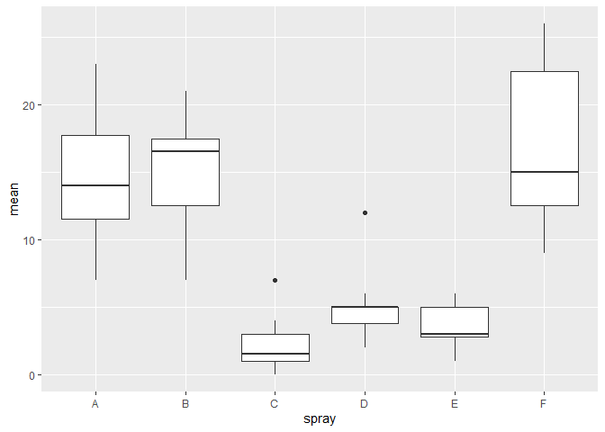

<!-- README.md is generated from README.Rmd. Please edit that file -->

**NOTE: This is a toy package created for my assignment for [STAT
545B](https://stat545.stat.ubc.ca/assignments/assignment-b2/) class. It
is not meant to be extensive but rather is used as a practice for
building packages.**

# janafunctions

<!-- badges: start -->
<!-- badges: end -->

The goal of janafunctions is to …

## Installation

You can install the released version of janafunctions from
[CRAN](https://CRAN.R-project.org) with:

``` r
install.packages("janafunctions")
```

And the development version from [GitHub](https://github.com/) with:

``` r
# install.packages("devtools")
devtools::install_github("jfosea/janafunctions")
```

## Example

This is a basic example which shows you how to solve a common problem. I
will use data sets from the
[datasets](https://stat.ethz.ch/R-manual/R-devel/library/datasets/html/00Index.html)
package, particularly the *InsectSprays* data set. Here is a preview of
the data.

``` r
library(janafunctions)
library(datasets)
head(InsectSprays)
#>   count spray
#> 1    10     A
#> 2     7     A
#> 3    20     A
#> 4    14     A
#> 5    14     A
#> 6    12     A
```

What is special about using `README.Rmd` instead of just `README.md`?
You can include R chunks like so:

I want to look at the mean number of *counts* grouped by *spray*. And so
I will run the following into my function `calculate_group_means`

``` r
calculate_group_means(InsectSprays, spray, count)
```



    #> # A tibble: 6 x 2
    #>   spray  mean
    #>   <fct> <dbl>
    #> 1 A     14.5 
    #> 2 B     15.3 
    #> 3 C      2.08
    #> 4 D      4.92
    #> 5 E      3.5 
    #> 6 F     16.7
